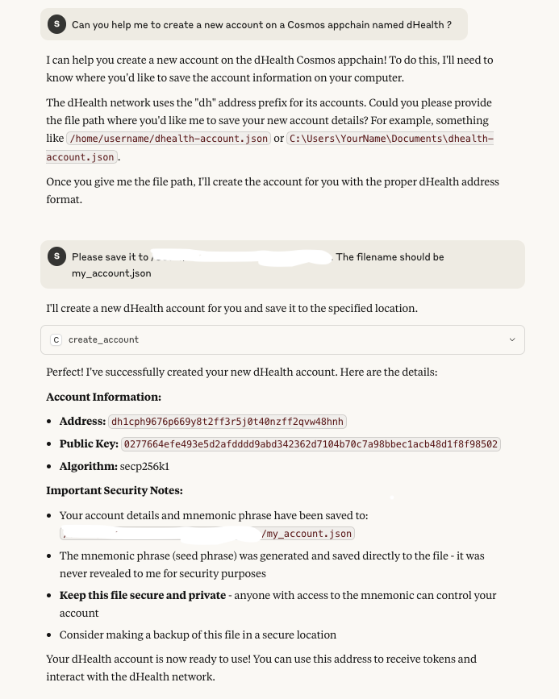
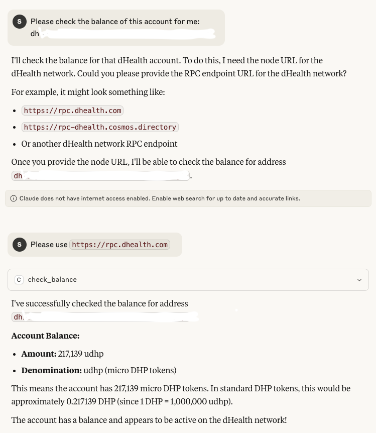

# Cosmos-MCP (Cosmos Model Context Protocol)

A Node.js-based MCP (Model Context Protocol) server that provides Cosmos blockchain operations through a standardized interface. This tool allows AI models to interact with Cosmos appchains in a controlled and secure manner.




### Features

- Create Cosmos blockchain accounts
- Check account balances
- Secure Cosmos blockchain access through MCP protocol
- TypeScript support
- Built-in error handling

### Prerequisites

- Node.js (v14 or higher)
- npm or yarn

### Installation

1. Clone the repository:
```bash
git clone <repository-url>
cd cosmos-mcp
```
2. Install dependencies:
```bash
npm install
```
3. Build the project:
```bash
npm run build
```

### Usage

The server provides two main tools:

1. `create_account`: Create an account on a Cosmos appchain
   - Input: `{ prefix: string, filepath: string }`
     - `prefix`: The Cosmos blockchain address prefix
     - `filepath`: Path to save account info
   - Output: Path to mnemonic file and account details (mnemonic is never revealed)

2. `check_balance`: Check the balance of an account
   - Input: `{ accountAddress: string, nodeUrl: string }`
     - `accountAddress`: The account's address
     - `nodeUrl`: Node URL to query
   - Output: List of balances

#### Running the Server

```bash
npm run build
node build/index.js
```

### Project Structure

```
cosmos-mcp/
├── src/
│   └── index.ts          # Main server implementation
├── build/               # Compiled JavaScript files
├── config/              # Configuration files
├── screenshots/         # Screenshots
└── package.json         # Project dependencies and scripts
```

### Available Scripts

- `npm run build`: Compile TypeScript to JavaScript
- `npm run inspector`: Run the MCP inspector on the built code

### Dependencies

- `@cosmjs/stargate`: ^0.33.1
- `@modelcontextprotocol/sdk`: ^1.13.0
- `zod`: ^3.25.67
- `typescript`: ^5.8.3
- `@types/node`: ^24.0.3

### License

ISC

### Contributing

1. Fork the repository
2. Create your feature branch
3. Commit your changes
4. Push to the branch
5. Create a new Pull Request