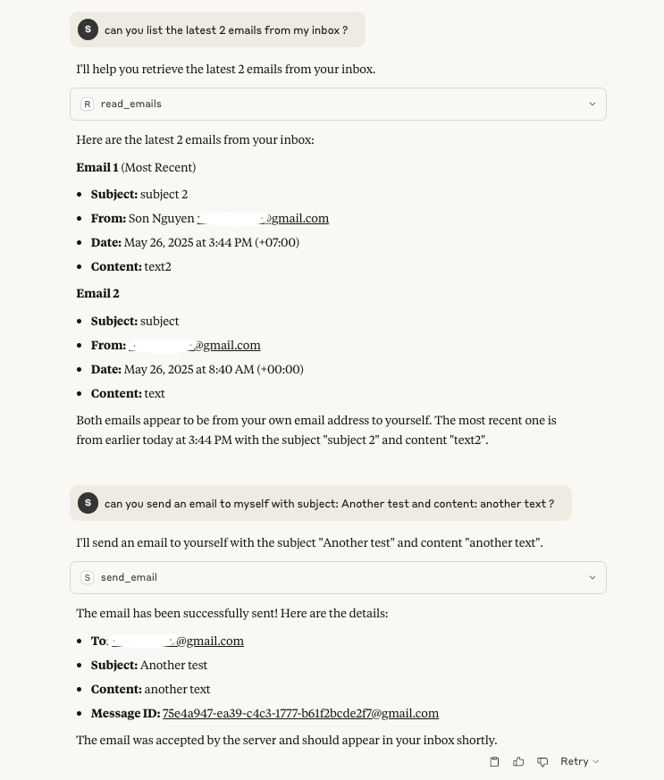
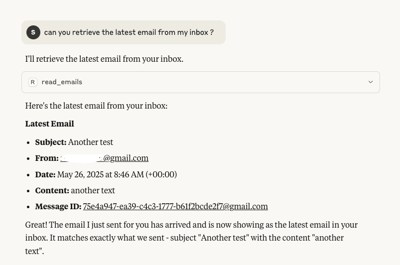

# Email MCP (Model Context Protocol)

Email MCP is a Node.js application that implements the Model Context Protocol (MCP) for email operations. It provides functionality for both IMAP (receiving emails) and SMTP (sending emails) operations.




## Features
- Email receiving via IMAP
- Email sending via SMTP
- TypeScript support
- Model Context Protocol integration

## Prerequisites
- Node.js (Latest LTS version recommended)
- npm or yarn package manager

## Installation

1. Clone the repository:
```bash
git clone <repository-url>
cd fs-mcp
```

2. Install dependencies:
```bash
npm install
```

3. Build the project:
```bash
npm run build
```

## Usage

The server provides two main tools for email operations:

1. `receive_email`: Receive emails via IMAP
    - Input:
    ```js
      {
        folder: string,
        noEmails: number
      }
    ```
    - Returns: Array of email messages with headers and content

2. `send_email`: Send emails via SMTP
   - Input:
    ```js
    {
      receiver: string,
      subject: string,
      textContent: string,
      htmlContent: string
    }
    ```
   - Returns: Success status and message ID

### Running the Server

```bash
npm run build
node build/index.js
```

## Development

### Project Structure
```
email-mcp/
├── build/          # Compiled JavaScript files
├── src/            # Source TypeScript files
│   ├── index.ts    # Main entry point
│   ├── imap.ts     # IMAP functionality
│   └── smtp.ts     # SMTP functionality
├── config/         # Configuration files
└── package.json    # Project dependencies and scripts
```

### Available Scripts

- `npm run build`: Compile TypeScript to JavaScript
- `npm run inspector`: Run the MCP inspector on the built code

## Dependencies
- `@modelcontextprotocol/sdk`: ^1.12.0
- `imap`: ^0.8.19
- `mailparser`: ^3.7.3
- `nodemailer`: ^7.0.3
- `zod`: ^3.25.23

## License

ISC