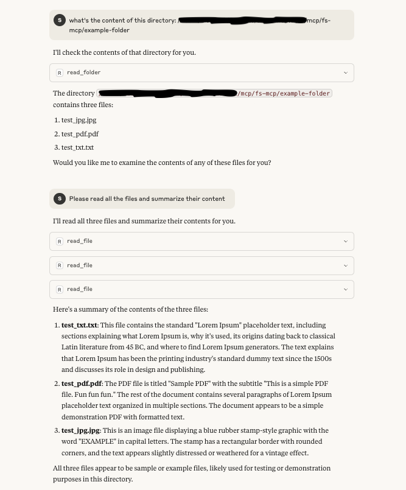

# FS-MCP (File System Model Context Protocol)

A Node.js-based MCP (Model Context Protocol) server that provides file system operations through a standardized interface. This tool allows AI models to interact with the file system in a controlled and secure manner.



## Features

- Read file contents (including text, images, and PDFs)
- List directory contents
- Create new directories
- Create new files with specified content
- Secure file system access through MCP protocol
- TypeScript support
- Built-in error handling

## Prerequisites

- Node.js (v14 or higher)
- npm or yarn

## Installation

1. Clone the repository:
```bash
git clone <repository-url>
cd fs-mcp
```

2. Install dependencies:
```bash
npm install
```

3. Build the project:
```bash
npm run build
```

## Usage

The server provides four main tools:

1. `read_file`: Read the contents of a file
   - Input: `{ uri: string }` (absolute path to the file)
   - Note: PDF files will be converted to a series of images.

2. `read_folder`: List contents of a directory
   - Input: `{ uri: string }` (absolute path to the directory)

4. `create_folder`: Create a new directory
   - Input: `{ uri: string }` (absolute path for the new directory)
   - Creates a new directory at the specified path
   - Returns success message if directory is created successfully

3. `create_file`: Create a new file with specified content
   - Input: `{ uri: string, content: string }` (absolute path for the new file and its content)
   - Creates a new file at the specified path with the given content
   - Returns success message if file is created successfully

### Running the Server

```bash
npm run build
node build/index.js
```

## Development

### Project Structure

```
fs-mcp/
├── src/
│   ├── index.ts          # Main server implementation
│   └── strategies/       # File reading strategies
├── build/               # Compiled JavaScript files
├── config/             # Configuration files
└── package.json        # Project dependencies and scripts
```

### Available Scripts

- `npm run build`: Compile TypeScript to JavaScript
- `npm run inspector`: Run the MCP inspector on the built code

## Dependencies

- `@modelcontextprotocol/sdk`: ^1.11.0
- `zod`: ^3.24.4
- `typescript`: ^5.8.3
- `@types/node`: ^22.15.16

## License

ISC

## Contributing

1. Fork the repository
2. Create your feature branch
3. Commit your changes
4. Push to the branch
5. Create a new Pull Request
