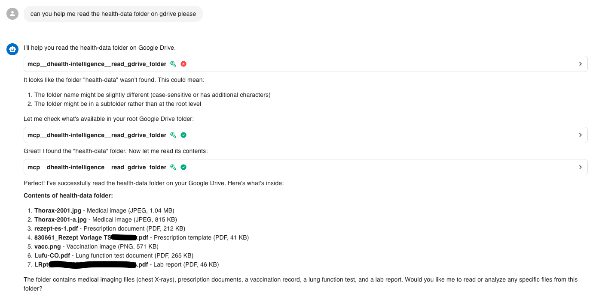
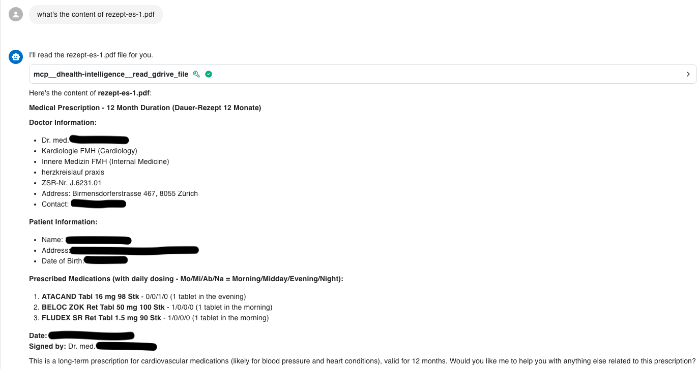
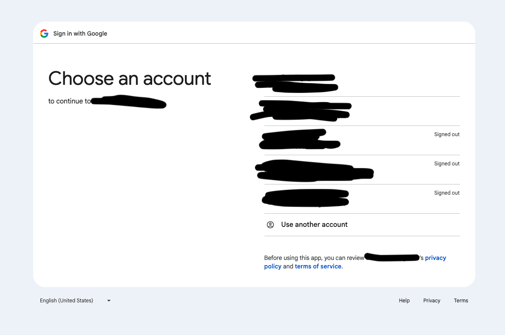
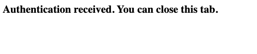

# gdrive-mcp

> A small Node.js / TypeScript MCP component that reads files from Google Drive and exposes them to the Model Context Protocol (MCP).

- Authenticates using oauth2 from browser (screenshot).
- Allows folder/file access across all available content (including shared materials).






## Features
- Strategy-based Google Drive file reader: see `src/strategies/gdriveFileReader.ts`.
- OAuth helper utilities for Google API: see `src/utils/auth.ts`.
- Built for TypeScript, outputs to `build/` and ships a CLI entry at `build/index.js`.

## Requirements
- Node.js (18+ recommended)
- npm or compatible package manager
- Google Cloud project with Drive API enabled and OAuth 2.0 credentials

## Install
Clone the repo and install dependencies:

```bash
npm install
```

## Build
Compile TypeScript to `build/`:

```bash
npm run build
```

After building you can run the package locally with:

```bash
node build/index.js
```

The package installs a bin called `gdrive-mcp` that points to `build/index.js`.

## Configuration
- Provide your Google OAuth credentials and any runtime configuration via your environment or a config file. The repository contains `config/claude_desktop_config.json` as an example config location used by other MCP components.
- See `src/utils/auth.ts` for how credentials are loaded and used.

## Development
- Type definitions and dev dependencies are already listed in `package.json`.
- Use `tsc` or `npm run build` to compile.
