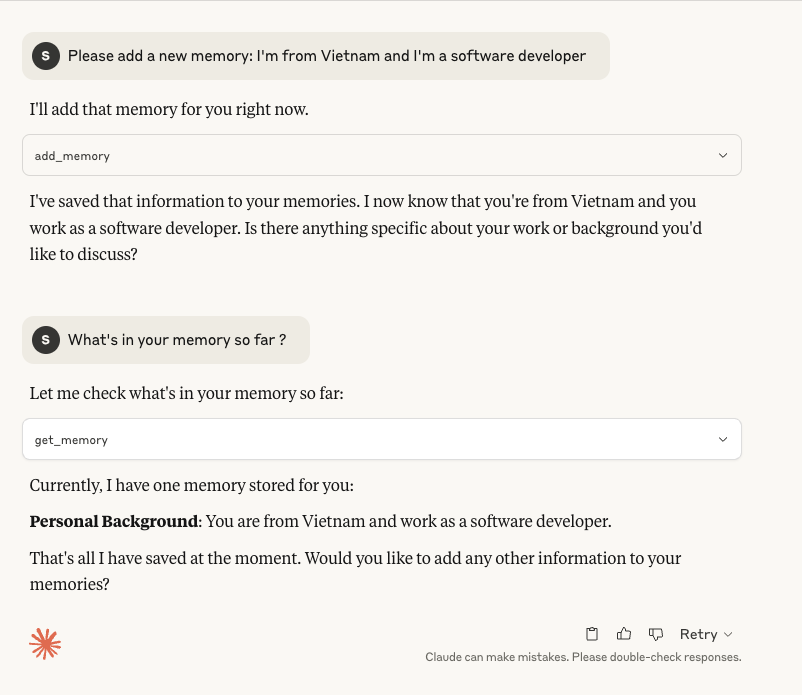

# Memory MCP

A Model Context Protocol (MCP) server implementation for managing and retrieving topic-based memories.



## Description

Memory MCP is a server that implements the Model Context Protocol, providing functionality to store and retrieve topic-based memories. It allows for organizing information by topics and maintaining a collection of notes associated with each topic.

## Features

- Topic-based memory organization
- Add new memories with topics and notes
- Retrieve memories by topic
- Persistent storage using JSON file
- Built with TypeScript for type safety

## Prerequisites

- Node.js (Latest LTS version recommended)
- npm or yarn package manager

## Installation

1. Clone the repository:
```bash
git clone <repository-url>
cd memory-mcp
```

2. Install dependencies:
```bash
npm install
```

## Building the Project

To build the project, run:
```bash
npm run build
```

This will:
- Compile TypeScript code to JavaScript
- Set appropriate permissions for the executable

## Usage

The server can be inspected using the MCP inspector:
```bash
npm run inspector
```

## Project Structure

```
memory-mcp/
├── src/
│   └── index.ts         # Main server implementation
├── config/              # Configuration files
├── build/              # Compiled JavaScript files
├── package.json        # Project dependencies and scripts
└── tsconfig.json      # TypeScript configuration
```

## Dependencies

- `@modelcontextprotocol/sdk`: Core MCP SDK for server implementation
- `zod`: Runtime type checking and validation
- `typescript`: Development dependency for TypeScript support

## License

ISC

## Contributing

Feel free to submit issues and enhancement requests. 