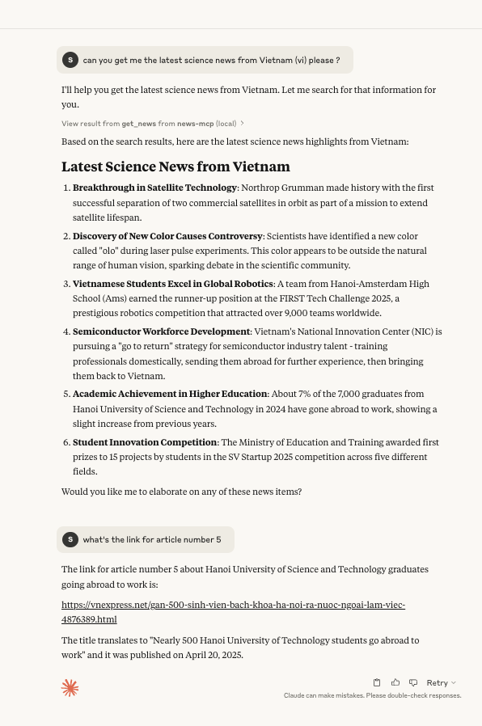

# News MCP (Model Context Protocol)

A Node.js tool built with TypeScript that implements the Model Context Protocol for news-related functionality.



## Features

- Built with TypeScript
- Implements Model Context Protocol
- Uses Zod for runtime type validation

## Installation

```bash
# Clone the repository
git clone git@github.com:bitlab-tech/mcp.git

# Navigate to the project directory
cd mcp
cd news-mcp

# Install dependencies
npm install

# Build the project
npm run build
```

## Dependencies

- @modelcontextprotocol/sdk: ^1.9.0
- zod: ^3.24.2

## License

ISC