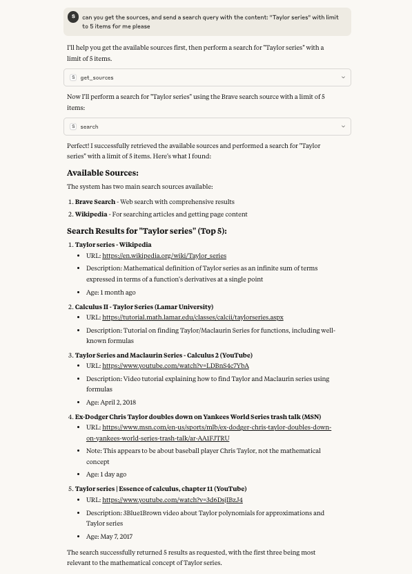

# Search MCP

A Model Context Protocol (MCP) implementation for search functionality.



## Description

This project implements a search functionality using the Model Context Protocol (MCP) framework. It provides an interface for query-related operations.

## Prerequisites

- Node.js (Latest LTS version recommended)
- npm (comes with Node.js)

## Installation

1. Clone the repository:
```bash
git clone <repository-url>
cd search-mcp
```

2. Install dependencies:
```bash
npm install
```

3. Build the project:
```bash
npm run build
```

## Usage

After building the project, you can use the `news` command:

```bash
./build/index.js
```

## Development

### Project Structure

```
search-mcp/
├── build/          # Compiled JavaScript files
├── config/         # Configuration files
├── src/           # Source TypeScript files
├── package.json   # Project dependencies and scripts
└── tsconfig.json  # TypeScript configuration
```

### Available Scripts

- `npm run build`: Compiles TypeScript files and makes the output executable
- `npm run inspector`: Runs the MCP inspector on the built index.js file

### Dependencies

Main dependencies:
- @modelcontextprotocol/sdk: ^1.12.1
- zod: ^3.25.42

Development dependencies:
- @types/node: ^22.15.27
- typescript: ^5.8.3

## License

ISC